# Task Planner

## Table of Contents
1. [What is Task Planner?](#what-is-task-planner)
2. [Purpose](#purpose)
3. [System Architecture](#system-architecture)
   - [1. Console Application (`console`)](#1-console-application-console)
   - [2. Task Service (`task`)](#2-task-service-task)
   - [3. Frontend Application (`frontend`)](#3-frontend-application-frontend)
4. [Technology Stack and Justification](#technology-stack-and-justification)
5. [Project Structure](#project-structure)
6. [How to Run Tests](#how-to-run-tests)
7. [Local Development Setup](#local-development-setup)
   - [1. Running the Console Application](#1-running-the-console-application)
   - [2. Running the Task Service](#2-running-the-task-service)
   - [3. Running the Frontend Application](#3-running-the-frontend-application)
8. [Running with Docker Compose](#running-with-docker-compose)
   - [1. Grant Execution Permission to `build.sh`](#1-grant-execution-permission-to-buildsh)
   - [2. Start Services with Docker Compose](#2-start-services-with-docker-compose)
   - [3. Running the Console Application](#3-running-the-console-application)
   - [4. Accessing the Services](#4-accessing-the-services)
9. [Task Planner API Documentation](#task-planner-api-documentation)
   - [General Information](#general-information)
   - [Endpoints](#endpoints)
     - [1. List Developers](#1-list-developers)
     - [2. Create a Task](#2-create-a-task)
     - [3. List Tasks](#3-list-tasks)
     - [4. Automatically Schedule Tasks](#4-automatically-schedule-tasks)


    
## What is Task Planner?

Task Planner is a web application designed to efficiently distribute tasks among a team of developers based on their capabilities and workload. It collects task information from multiple external providers and generates an optimized weekly schedule to ensure the fastest possible completion time.

## Purpose

The primary goal of Task Planner is to automate the process of task allocation by considering:

- Task duration and complexity provided by different task providers.
- Developer efficiency, where each developer has a different productivity rate.
- A fair and optimized distribution strategy that minimizes the total completion time.

The system fetches tasks from multiple APIs, processes the data, and assigns tasks to developers based on an optimized scheduling algorithm. The results are displayed in a user-friendly interface, allowing teams to track assignments and progress.

## System Architecture

Task Planner consists of three main applications, each designed with modularity and scalability in mind:

### 1. Console Application (`console`)
- Responsible for fetching tasks from external providers and storing them in the database.
- Built with **Cobra CLI** for structured command-line execution.
- Supports **worker pools** and **goroutines** to efficiently handle multiple providers concurrently.
- Designed with an **extensible architecture**, allowing easy integration of new task providers in the future.

<p align="center">
  
</p>

### 2. Task Service (`task`)
- Core backend service responsible for:
  - Managing **developers** and **tasks**.
  - Implementing an **optimized scheduling algorithm** to distribute tasks among developers based on their productivity levels.
- Uses **Go channels** for efficient task processing and concurrency management.
- Exposes APIs with **Swagger documentation** for better usability.
- Stores data in **PostgreSQL**, utilizing **Testcontainers-Postgres** for testing.

<p align="center">
  
</p>

### 3. Frontend Application (`frontend`)
- A web interface for:
  - Viewing developers and tasks.
  - Displaying scheduled task assignments.
  - Client-side interactions for task scheduling.
- Built with **React**, ensuring a responsive and interactive UI.

## Technology Stack and Justification

| Technology                | Reason for Selection |
|---------------------------|----------------------|
| **Go**                    | Chosen for its high performance, concurrency support (goroutines & channels), and suitability for backend services. |
| **Worker Pool Pattern**   | Efficiently handles multiple task providers without blocking the main process. |
| **Cobra CLI**             | Provides a structured command-line interface for the console application. |
| **Go Channels**           | Enables safe and efficient concurrent processing of tasks. |
| **PostgreSQL**            | A reliable relational database for structured task and developer data. |
| **Testcontainers-Postgres** | Facilitates integration testing in an isolated environment. |
| **React**                 | Ensures a dynamic and interactive frontend for task visualization. |
| **Swagger**               | Provides API documentation for easy integration and usage. |
| **Prometheus**            | Used for monitoring and gathering application metrics. |

This architecture ensures **scalability, extensibility, and performance efficiency** while maintaining modularity across different components.

## Project Structure

The project directory structure is as follows:

 ```bash
 .
├── Dockerfile.console
├── Dockerfile.frontend
├── Dockerfile.task
├── Readme.md
├── backend
│   ├── cmd
│   │   ├── console
│   │   │   └── main.go
│   │   └── task
│   │       └── main.go
│   ├── go.mod
│   ├── go.sum
│   ├── internal
│   │   ├── console
│   │   │   ├── cmd
│   │   │   │   ├── root.go
│   │   │   │   └── start.go
│   │   │   ├── input
│   │   │   │   └── prompt.go
│   │   │   ├── provider
│   │   │   │   └── fetch.go
│   │   │   └── worker
│   │   │       └── pool.go
│   │   ├── pkg
│   │   │   ├── config
│   │   │   │   └── config.go
│   │   │   ├── database
│   │   │   │   └── postgres
│   │   │   │       ├── autocrudder.go
│   │   │   │       ├── connect.go
│   │   │   │       └── tables
│   │   │   │           ├── developer.go
│   │   │   │           └── task.go
│   │   │   ├── migrate
│   │   │   │   └── migrate.go
│   │   │   ├── payload
│   │   │   │   └── payload.go
│   │   │   ├── repository
│   │   │   │   ├── contract.go
│   │   │   │   └── postgres
│   │   │   │       ├── repository.go
│   │   │   │       └── repository_test.go
│   │   │   └── testcontainer
│   │   │       └── pg.go
│   │   └── task
│   │       ├── docs
│   │       │   ├── docs.go
│   │       │   ├── swagger.json
│   │       │   └── swagger.yaml
│   │       ├── handler
│   │       │   ├── handler.go
│   │       │   └── metric.go
│   │       ├── server
│   │       │   └── server.go
│   │       └── service
│   │           ├── schedule.go
│   │           ├── service.go
│   │           └── service_test.go
│   └── pkg
│       ├── automapper
│       │   └── automapper.go
│       ├── log
│       │   └── log.go
│       └── validate
│           └── request.go
├── build.sh
├── deployment
│   ├── docker
│   │   └── docker-compose.yml
│   └── k8s
└── frontend
    ├── README.md
    ├── package-lock.json
    ├── package.json
    ├── public
    │   ├── index.html
    │   ├── logo192.png
    │   ├── logo512.png
    │   ├── manifest.json
    │   └── robots.txt
    └── src
        ├── App.css
        ├── App.js
        ├── index.css
        ├── index.js
        ├── reportWebVitals.js
        └── styles.css
   ```

## How to Run Tests

To run tests for the project, follow these steps:

1. Install dependencies:
   ```bash
   go mod tidy
   ```
2. For all tests across the project, run:
   ```bash
   cd backend/ && go test ./...
   ```

## Local Development Setup

To run Task Planner locally, follow these steps for each component:

### 1. Running the Console Application
Navigate to the `console` directory and start the interactive CLI:
  
```bash
cd backend/cmd/console  
go run . start  
```

This will allow you to interactively fetch tasks from providers and store them in the database.

### 2. Running the Task Service
Before starting the task service, set up the required **PostgreSQL environment variables** in a `.env` file:

```bash
export POSTGRES_USER=your_username  
export POSTGRES_PASSWORD=your_password  
export POSTGRES_DB=task_planner  
export POSTGRES_HOST=localhost  
export POSTGRES_PORT=5432  
```

Then, navigate to the `task` service directory and run:

```bash
cd backend/cmd/task  
go run .  
```

The API will be available at `http://localhost:<PORT>/swagger/index.html`, where you can explore and test the endpoints.

### 3. Running the Frontend Application
Navigate to the `frontend` directory and install dependencies:

```bash
cd frontend  
npm install  
```

Start the frontend application:

```bash
npm start  
```

Once started, visit `http://localhost:3000` in your browser to access the application.

### Additional Notes:
- Ensure **PostgreSQL** is running before starting the backend services.
- If using **Docker**, you can set up a local PostgreSQL instance with:

  ```bash
  docker run --name postgres -e POSTGRES_USER=your_username -e POSTGRES_PASSWORD=your_password -e POSTGRES_DB=task_planner -p 5432:5432 -d postgres  
  ``` 

- Use `.env` files to manage environment variables instead of setting them manually.
- The console application can support new providers dynamically, making it easy to extend.

## Running with Docker Compose

To run the entire Task Planner stack using Docker Compose, follow these steps:

### 1. Grant Execution Permission to `build.sh`
Before building the Docker images, make sure `build.sh` is executable:

```bash
chmod +x build.sh  
```

Then, run the script to build the images (version `0.0.1` will be created):

```bash
./build.sh  
```

### 2. Start Services with Docker Compose
Navigate to the `deployment/docker` directory and start all services:

```bash 
cd deployment/docker  
docker-compose up -d  
```

This will start:
- **PostgreSQL**
- **Console Application**
- **Task Service**
- **Frontend Application**

### 3. Running the Console Application
To interactively fetch and store tasks from providers, run:

```bash
docker-compose run --rm console start  
```

### 4. Accessing the Services
- **Frontend UI:** `http://localhost:3000`  
- **Task API (Swagger UI):** `http://localhost:8080/swagger/index.html`  
- **PostgreSQL:** `localhost:5432` (make sure the correct database credentials are used)

### Additional Notes:
- Ensure **Docker** and **Docker Compose** are installed on your system.
- If any service fails, check logs with:

```bash
  docker-compose logs -f <service_name>  
```

- Stop and remove all running containers:

```bash
  docker-compose down  
```

This setup ensures that all components run seamlessly in **isolated containers**, making local development and testing more efficient. 🚀

# Task Planner API Documentation

## General Information
- **API Name**: Task Planner API
- **Description**: The Task Planner API provides endpoints for managing tasks with CRUD operations.
- **Version**: 1.0
- **Host**: `localhost:8080`
- **Contact**:
  - **Name**: Mehmet Ali Mergen
  - **Email**: support@taskplanner.com
- **License**: Apache 2.0

---

## Endpoints

### 1. **List Developers**
- **Endpoint**: `GET /developers`
- **Description**: Retrieves a list of all developers.
- **Tags**: `developer`
- **Response**:
  - `200`: Successful response. Contains a list of developers.
  - `500`: Server error.

#### Example CURL Command:
```bash
curl -X GET http://localhost:8080/developers
```

#### Example Response (200):
```bash
{
  "developers": [
    {
      "id": 1,
      "firstName": "John",
      "lastName": "Doe",
      "email": "john.doe@example.com",
      "capacity": 10,
      "createdAt": "2023-10-01T12:00:00Z",
      "updatedAt": "2023-10-01T12:00:00Z"
    }
  ]
}
```

---

### 2. **Create a Task**
- **Endpoint**: `POST /task`
- **Description**: Creates a new task.
- **Tags**: `task`
- **Request Body**:
  - `name`: Task name (string, 3-100 characters).
  - `difficulty`: Task difficulty (integer, 1-10).
  - `duration`: Task duration (integer, 1-1000).
  - `externalId`: External ID (integer).
  - `provider`: Provider information (string, 3-150 characters).
- **Response**:
  - `200`: Successful response. Returns the ID and creation date of the task.
  - `400`: Invalid request.
  - `500`: Server error.

#### Example CURL Command:
```bash

curl -X POST http://localhost:8080/task \
  -H "Content-Type: application/json" \
  -d '{
        "name": "Implement authentication",
        "difficulty": 5,
        "duration": 8,
        "externalId": 123,
        "provider": "Internal"
      }'
```

#### Example Response (200):
```bash
{
  "id": 1,
  "createdAt": "2023-10-01T12:00:00Z"
}
```

---

### 3. **List Tasks**
- **Endpoint**: `GET /tasks`
- **Description**: Retrieves a list of all tasks.
- **Tags**: `task`
- **Query Parameters**:
  - `limit`: Pagination limit (integer).
  - `offset`: Pagination offset (integer).
- **Response**:
  - `200`: Successful response. Contains a list of tasks.
  - `400`: Invalid request.
  - `500`: Server error.

#### Example CURL Command:
```bash
curl -X GET "http://localhost:8080/tasks?limit=10&offset=0"
```

#### Example Response (200):
```bash
{
  "tasks": [
    {
      "id": 1,
      "name": "Implement authentication",
      "difficulty": 5,
      "duration": 8,
      "externalId": 123,
      "provider": "Internal",
      "createdAt": "2023-10-01T12:00:00Z",
      "updatedAt": "2023-10-01T12:00:00Z"
    }
  ]
}
```

---

### 4. **Automatically Schedule Tasks**
- **Endpoint**: `GET /tasks/schedule`
- **Description**: Automatically schedules tasks to developers.
- **Tags**: `task`
- **Response**:
  - `200`: Successful response. Contains scheduled tasks and total work hours.
  - `500`: Server error.

#### Example CURL Command:
```bash
veli -X GET http://localhost:8080/tasks/schedule
```

#### Example Response (200):
```bash
{
  "assignments": [
    {
      "developerTasks": [
        {
          "developer": {
            "id": 1,
            "firstName": "John",
            "lastName": "Doe",
            "email": "john.doe@example.com",
            "capacity": 10,
            "createdAt": "2023-10-01T12:00:00Z",
            "updatedAt": "2023-10-01T12:00:00Z"
          },
          "tasks": [
            {
              "id": 1,
              "name": "Implement authentication",
              "difficulty": 5,
              "duration": 8,
              "externalId": 123,
              "provider": "Internal",
              "createdAt": "2023-10-01T12:00:00Z",
              "updatedAt": "2023-10-01T12:00:00Z"
            }
          ]
        }
      ]
    }
  ],
  "minWeek": 1,
  "totalElapsedWorkHour": 8,
  "totalWorkDay": 1
}
```
